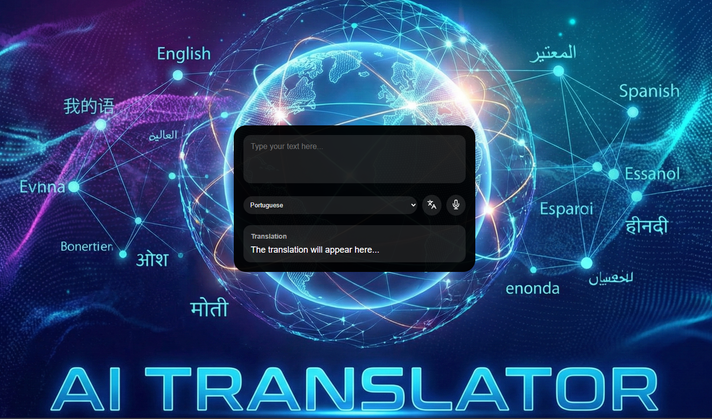

<h1 align="center">AI Translator </h1>

  
  <a href="#-live-demo">Live Demo</a>&nbsp;&nbsp;&nbsp;|&nbsp;&nbsp;&nbsp;
  <a href="#-screenshots">Screenshots</a>&nbsp;&nbsp;&nbsp;|&nbsp;&nbsp;&nbsp;
  <a href="#-technologies">Technologies</a>&nbsp;&nbsp;&nbsp;|&nbsp;&nbsp;&nbsp;
  <a href="#-features">Features</a>&nbsp;&nbsp;&nbsp;|&nbsp;&nbsp;&nbsp;
  <a href="#-license">License</a>&nbsp;&nbsp;&nbsp;|&nbsp;&nbsp;&nbsp;
  <a href="#-contributing">Contributing</a>&nbsp;&nbsp;&nbsp;|&nbsp;&nbsp;&nbsp;
  <a href="#support">Support</a>  

 AI Translator is a tool that translates text and also supports voice input through the microphone.

  

 

## 🌐 Live Demo

  

  Tip: Use right-click → “Open in new tab”.

 

## 📸 Screenshots

 

## 🛠 Technologies

- HTML
- CSS
- JavaScript
- [MyMemory API](https://mymemory.translated.net/doc/spec.php)
- Git and GitHub

 

## ✨ Features

- Text translation
- Multiple language support
- Voice input (microphone)
- Clean and easy-to-use interface

 

## 📜 License

- This project is licensed under the [MIT License](https://choosealicense.com/licenses/mit/)

 

## 🫱🏻‍🫲🏻 Contributing

 Contributions, issues, and feature requests are welcome! Please, feel free to do it! 😉 

 

## 🌟 Support

 If you like this project, please give it a star ⭐ and share it with others! 😄 

